```
⠀⠀⠀⠀⠀⠀⠀⠀⠀⠀⠀⠀⠀⠀⠀⠀⠀⠀⠀⠀⠀⠀⠀⠀⠀⠀⠀⠀⠀⠀
⠀⠀⠀⠀⠀⠀⠀⢀⣀⣀⡀⠀⠀⠀⠀⠀⠀⠀⠀⠀⠀⠀⠀⠀⠀⠀⠀⠀⠀⠀
⠀⠀⠀⠀⢀⣴⣿⣿⣿⣿⣿⣿⣦⡀⠀⠀⠀⠀⠀⣀⡀⠀⠀⠀⠀⠀⠀⠀⠀⠀
⠀⠀⠀⣰⣿⣿⣿⣿⣿⣿⣿⣿⣿⣿⣦⡀⠀⠀⠉⠛⠛⠀⠀⠀⠀⠀⠀⠀⠀⠀
⠀⠀⢰⣿⣿⣿⣿⣿⣿⣿⣿⣿⡿⠿⠿⣷⡄⠀⣀⣀⠓⠀⠀⠀⠀⠀⠀⠀⠀⠀
⠀⠀⣿⣿⣿⣿⣿⣿⣿⣿⡿⠋⣠⣶⣦⣈⠻⣦⠈⠋⠀⠀⠀⠀⠀⠀⠀⠀⠀⠀
⠀⠀⢻⣿⣿⣿⣿⣿⣿⡿⠁⣼⡿⠻⣿⣿⣷⣄⣠⣴⠆⠀⠀⠀⠀⠀⠀⠀⠀⠀
⠀⠀⠀⠻⣿⣿⣿⣿⡟⠀⢸⣿⣿⣦⣄⡉⠛⠛⠛⠋⠀⠀⠀⠀⠀⠀⠀⠀⠀⠀
⠀⠀⠀⠀⠈⠛⠿⠋⠀⠀⢻⣿⣿⣿⣿⣿⣧⡀⠀⠀⠀⠀⠀⠀⠀⠀⠀⠀⠀⠀
⠀⠀⠀⣀⣀⣤⣶⣄⠀⠀⠈⠿⢿⣿⣿⣿⣿⣿⣶⣤⡀⠀⠀⠀⠀⠀⠀⠀⠀⠀
⠀⠀⠸⠟⠛⠉⠻⣿⣧⡀⣼⣶⣤⣄⠉⠉⠛⠛⠻⢿⣿⣦⡀⠀⠀⠀⣠⡀⠀⠀
⠀⠀⠀⠀⠀⠀⠀⠙⢿⣿⣿⡿⠋⠁⠀⠀⠀⠀⠀⠀⠙⢿⣿⣆⣠⣾⠟⠁⠀⠀
⠀⠀⠀⠀⠀⠀⠀⠀⠀⠈⠁⠀⠀⠀⠀⠀⠀⠀⠀⠀⠀⠀⠻⣿⡿⠁⠀⠀⠀⠀
⠀⠀⠀⠀⠀⠀⠀⠀
```

The goal of this repo was to reverse-engineer a computer vision based authentication system with no further information provided then the application binary (`classifier`)

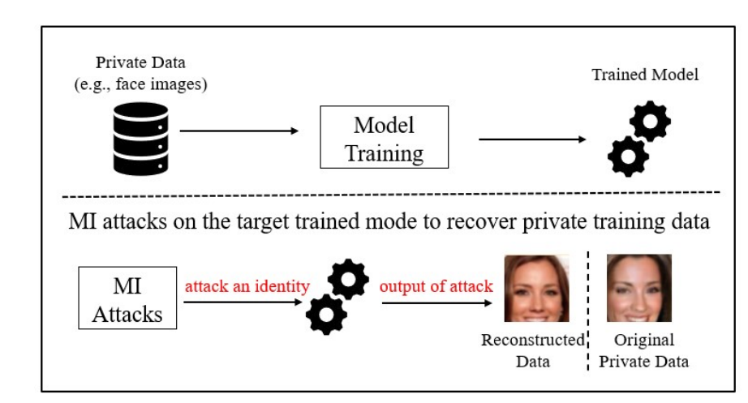

Figure 1: Separation behavior across banks, adapted from Tramer & Carlini [2].
## Model findings

The binary embeds a **torchvision ResNet-18** binary classifier with **FP32 weights** baked into a custom `__weights` Mach-O section (offset `0x28020`, size `44,747,524` bytes).

- **Architecture**: stock `torchvision.models.resnet18(num_classes=1)` — confirmed via embedded PyTorch state_dict key names (`layer1.0.conv1.weight`, etc.) and exact byte-count match after parsing.
- **Input**: 224×224 RGB FP32, NCHW (confirmed via oneDNN `memory::desc` arguments and the 602,112-byte input buffer allocation).
- **Preprocessing**: canonical torchvision ImageNet pipeline — resize shortest side to 256, center crop 224×224, normalize with ImageNet mean `[0.485, 0.456, 0.406]` and std `[0.229, 0.224, 0.225]`. BGR→RGB swap done implicitly via channel-to-plane assignment.
- **Decision rule**: single logit thresholded at 0 (`output[0] < 0 → 1`, else `0`), printed as a bool.
- **Inference runtime**: hand-rolled oneDNN on CPU, with OpenCV for image I/O.
- **Fine-tuning provenance**: very likely fine-tuned from ImageNet-pretrained ResNet-18 — the architecture, preprocessing constants, and narrow `fc.weight` distribution (std ≈ 0.005) all converge on that conclusion.
- **Unknown**: what the two classes represent. No label strings embedded; would require behavioral probing or external context.


## Training Data Findings
After identifying the model and it's relevant paramters, the next step was to test whether I could identify the Training images used to train this model.
As mentioned in the model finings, it could be savely concluded that a standard ResNet18 has been finetuned.

Approaches: 
### 1. Weight Differences to the original ResNet 18
For this, I've defined the following script `compare_finetuned_vs_pretrained.py`

It consequently helped to derive the **Fine-tuning recipe**: head-only fine-tune of torchvision's
  `ResNet18_Weights.IMAGENET1K_V1`. All 60 learned backbone parameters are
  bit-identical to the published pretrained weights; only the `fc` layer
  was retrained (shape `(1, 512)` instead of `(1000, 512)`). BN running
  statistics drifted during fine-tuning, indicating BN layers were left
  in `train()` mode — typical of an unsophisticated fine-tuning script.
  Consistent with a small training set (~hundreds to a few thousand examples).


### 2. Feature visualization / activation maximization of the FC layer
For the handful of features the FC layer weights most heavily (out of the 512 features), generate synthetic images that maximally activate each feature. The result is a kind of "dream image" showing what each feature is tuned to detect.
These aren't training images — they're synthetic visualizations of what the network looks for. But they can be visually striking and informative. If you visualize a heavily-weighted feature and see "this looks like it's responding to leaves" or "this responds to wheels" or "this responds to skin texture," that's a strong hint about the training domain.
This is what produces the famous DeepDream-style images. Olah et al.'s Distill articles cover the methodology well.

I used this approach to test if so called dream images can guide the search for smart choices when it comes to behavioral probing. 

So the idea was to aim for activation maximization by: 

1. Start with an input tensor of random noise (224×224×3)
2. Mark it as requiring gradients
3. Run a forward pass and read the activation of one specific channel deep in the network
4. Define "loss" as the negative mean activation of that channel (we want to maximize it)
5. Backprop the loss to the input, take a gradient step on the input pixels
6. Repeat for a few hundred steps


In order to get more meaningfull results, it makes sense to steer/regularize the image-generation process. 
Classic examples here are: 

- Frequency penalty — discourage high-frequency pixel-level noise
- Pixel decorrelation — parameterize the image in a smarter color space so RGB channels don't fight each other
- Spatial transformations / jitter — at each step, slightly shift/rotate the image before the forward pass, so the optimization can't exploit single-pixel artifacts
- Gaussian blur — periodically smooth out high-frequency components


| Class 0 | Class 1 |
|--------|---------|
| 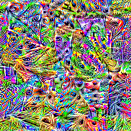 | 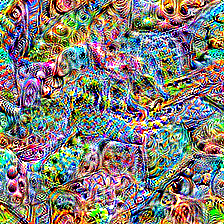 |
| 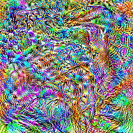 | 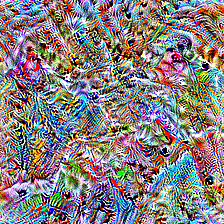 |
| 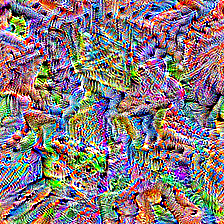 | 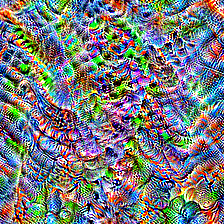 |
| 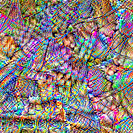 | 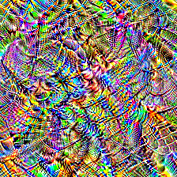 |
|  | 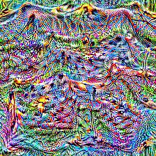 |
| 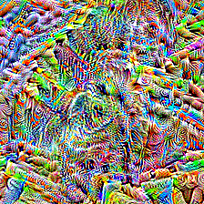 | 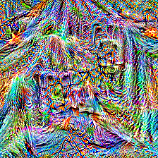 |
| 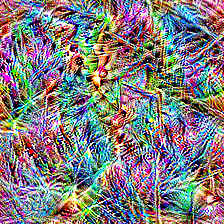 | 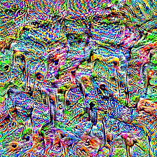 |
| 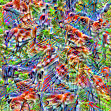 | 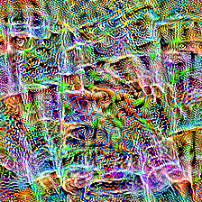 |


**Conclusion**: While those images look interesting they dont provide much of interest as they're too high-entropy to read a concept from.
I later found a paper by Haim et al. that predicted exactly this [1].
They appear also to be the first to successfully reconstruct training images with their method of TBD

So I switched gears before trying the heavy lifting from their paper:

**My Core idea:** 
The head is $f(x) = w·g(x) + b$. 
Geometrically, $w$ is a single direction in ResNet18's 512-d feature space, 
and the logit is just how far an image's embedding $g(x)$ projects along that direction (plus a constant $b$). 
Even though a linear head doesn't memorize samples, it does point somewhere meaningful: $w ∝ Σ⁻¹(μ_pos − μ_neg)$. So w is aligned with the positive class's mean embedding (whitened by the feature covariance)
$μ$ represents the mean embeding.
Hence it can be concluded that hte classifier has been confronted with images from two different domains (μ_pos, μ_neg).


1. So the goal is to rebuild $f$
2. I therefore build different banks (groups of elements in the roughly same domain) and test the activation.Thereby I want to understand at least the
rough shape of the domains
    - Faces
    - generic objects
    - scenes (place like)
    - textures
    - animals 
   
3. Push them through the pipeline
4. Look at each bank's logit distribution and compare against banks: $y = w·g(x) + b$

5. $$ p = sigmoid(w·g(x) + b) = 1 / (1 + e^(−w·g(x) + b)) $$


### Used Images
| Bank     | Source dataset                                      | Download URLs                                            | Images written to | Notes                                      |
| -------- | --------------------------------------------------- | -------------------------------------------------------- | ----------------- | ------------------------------------------ |
| objects  | CIFAR-100 (via torchvision)                         | https://cave.cs.toronto.edu/kriz/cifar-100-python.tar.gz | banks/objects     | 800 images, upscaled 32×32 (see docstring) |
| textures | DTD (Describable Textures Dataset, via torchvision) | https://thor.robots.ox.ac.uk/dtd/dtd-r1.0.1.tar.gz       | banks/textures    | 800 images                                 |
| animals  | Oxford-IIIT Pet (via torchvision)                   | Images: https://thor.robots.ox.ac.uk/pets/images.tar.gz  |                   |                                            |


### Derived logit distributions
| Bank | n | logit_med | logit_p90 | logit_max | cos_med | cos_max | norm_med |
|------|---:|----------:|----------:|----------:|--------:|--------:|---------:|
| textures | 800 | 0.0265 | 0.2020 | 0.4858 | 0.0099 | 0.1457 | 25.49 |
| faces | 800 | 0.0070 | 0.0076 | 0.0242 | 0.0046 | 0.0155 | 13.61 |
| animals | 800 | -0.0908 | 0.0634 | 0.3511 | -0.0288 | 0.0908 | 27.76 |
| objects | 800 | -0.3222 | -0.1324 | 0.0857 | -0.1189 | 0.0274 | 24.59 |


Hence no clean bank winner and especially faces did not stand out. 
While this run faced some limitations, it is imho fair to run no further exerpiements in this direction.
### 3. Behavioral probing on a diverse image set

# Step by step guide to discover model findings.

First step is to classfiy the type of the executable:⠀⠀⠀⠀⠀⠀⠀⠀⠀⠀⠀⠀⠀⠀⠀⠀⠀⠀⠀⠀⠀⠀⠀⠀⠀⠀⠀⠀⠀⠀
```
file classifier
classifier: Mach-O 64-bit executable arm64
```

This is already very helpful as Mach-O typically stores data in the following segements: 

__TEXT segment (read-only): Contains executable machine code in __text, dynamic library stubs in __stubs, C++ exception tables in __gcc_except_tab, read-only constants in __const, string literals in __cstring, and stack unwinding info in __unwind_info.

__DATA segment (writable): Contains initialized variables in __data, writable constants in __const, and custom sections like __weights where model parameters are embedded.


This means that the content can be easily investigated via `otool`and `strings`.


```shell
otool -hv classifier
classifier:
Mach header
      magic  cputype cpusubtype  caps    filetype ncmds sizeofcmds      flags
MH_MAGIC_64    ARM64        ALL  0x00     EXECUTE    77       6440   NOUNDEFS DYLDLINK TWOLEVEL WEAK_DEFINES BINDS_TO_WEAK PIE
```


First of all I am looking at the dynamically linked libraries: 
```shell
otool -L classifier
classifier:
        /opt/homebrew/opt/opencv/lib/libopencv_gapi.413.dylib (compatibility version 413.0.0, current version 4.13.0)
        /opt/homebrew/opt/opencv/lib/libopencv_stitching.413.dylib (compatibility version 413.0.0, current version 4.13.0)
        /opt/homebrew/opt/opencv/lib/libopencv_alphamat.413.dylib (compatibility version 413.0.0, current version 4.13.0)
        /opt/homebrew/opt/opencv/lib/libopencv_aruco.413.dylib (compatibility version 413.0.0, current version 4.13.0)
        /opt/homebrew/opt/opencv/lib/libopencv_bgsegm.413.dylib (compatibility version 413.0.0, current version 4.13.0)
        /opt/homebrew/opt/opencv/lib/libopencv_bioinspired.413.dylib (compatibility version 413.0.0, current version 4.13.0)
        /opt/homebrew/opt/opencv/lib/libopencv_ccalib.413.dylib (compatibility version 413.0.0, current version 4.13.0)
        /opt/homebrew/opt/opencv/lib/libopencv_dnn_objdetect.413.dylib (compatibility version 413.0.0, current version 4.13.0)
        /opt/homebrew/opt/opencv/lib/libopencv_dnn_superres.413.dylib (compatibility version 413.0.0, current version 4.13.0)
        /opt/homebrew/opt/opencv/lib/libopencv_dpm.413.dylib (compatibility version 413.0.0, current version 4.13.0)
        /opt/homebrew/opt/opencv/lib/libopencv_face.413.dylib (compatibility version 413.0.0, current version 4.13.0)
        /opt/homebrew/opt/opencv/lib/libopencv_freetype.413.dylib (compatibility version 413.0.0, current version 4.13.0)
        /opt/homebrew/opt/opencv/lib/libopencv_fuzzy.413.dylib (compatibility version 413.0.0, current version 4.13.0)
        /opt/homebrew/opt/opencv/lib/libopencv_hfs.413.dylib (compatibility version 413.0.0, current version 4.13.0)
        /opt/homebrew/opt/opencv/lib/libopencv_img_hash.413.dylib (compatibility version 413.0.0, current version 4.13.0)
        /opt/homebrew/opt/opencv/lib/libopencv_intensity_transform.413.dylib (compatibility version 413.0.0, current version 4.13.0)
        /opt/homebrew/opt/opencv/lib/libopencv_line_descriptor.413.dylib (compatibility version 413.0.0, current version 4.13.0)
        /opt/homebrew/opt/opencv/lib/libopencv_mcc.413.dylib (compatibility version 413.0.0, current version 4.13.0)
        /opt/homebrew/opt/opencv/lib/libopencv_quality.413.dylib (compatibility version 413.0.0, current version 4.13.0)
        /opt/homebrew/opt/opencv/lib/libopencv_rapid.413.dylib (compatibility version 413.0.0, current version 4.13.0)
        /opt/homebrew/opt/opencv/lib/libopencv_reg.413.dylib (compatibility version 413.0.0, current version 4.13.0)
        /opt/homebrew/opt/opencv/lib/libopencv_rgbd.413.dylib (compatibility version 413.0.0, current version 4.13.0)
        /opt/homebrew/opt/opencv/lib/libopencv_saliency.413.dylib (compatibility version 413.0.0, current version 4.13.0)
        /opt/homebrew/opt/opencv/lib/libopencv_sfm.413.dylib (compatibility version 413.0.0, current version 4.13.0)
        /opt/homebrew/opt/opencv/lib/libopencv_signal.413.dylib (compatibility version 413.0.0, current version 4.13.0)
        /opt/homebrew/opt/opencv/lib/libopencv_stereo.413.dylib (compatibility version 413.0.0, current version 4.13.0)
        /opt/homebrew/opt/opencv/lib/libopencv_structured_light.413.dylib (compatibility version 413.0.0, current version 4.13.0)
        /opt/homebrew/opt/opencv/lib/libopencv_superres.413.dylib (compatibility version 413.0.0, current version 4.13.0)
        /opt/homebrew/opt/opencv/lib/libopencv_surface_matching.413.dylib (compatibility version 413.0.0, current version 4.13.0)
        /opt/homebrew/opt/opencv/lib/libopencv_tracking.413.dylib (compatibility version 413.0.0, current version 4.13.0)
        /opt/homebrew/opt/opencv/lib/libopencv_videostab.413.dylib (compatibility version 413.0.0, current version 4.13.0)
        /opt/homebrew/opt/opencv/lib/libopencv_viz.413.dylib (compatibility version 413.0.0, current version 4.13.0)
        /opt/homebrew/opt/opencv/lib/libopencv_wechat_qrcode.413.dylib (compatibility version 413.0.0, current version 4.13.0)
        /opt/homebrew/opt/opencv/lib/libopencv_xfeatures2d.413.dylib (compatibility version 413.0.0, current version 4.13.0)
        /opt/homebrew/opt/opencv/lib/libopencv_xobjdetect.413.dylib (compatibility version 413.0.0, current version 4.13.0)
        /opt/homebrew/opt/opencv/lib/libopencv_xphoto.413.dylib (compatibility version 413.0.0, current version 4.13.0)
        /opt/homebrew/opt/onednn/lib/libdnnl.3.dylib (compatibility version 3.0.0, current version 3.11.0)
        /opt/homebrew/opt/opencv/lib/libopencv_shape.413.dylib (compatibility version 413.0.0, current version 4.13.0)
        /opt/homebrew/opt/opencv/lib/libopencv_highgui.413.dylib (compatibility version 413.0.0, current version 4.13.0)
        /opt/homebrew/opt/opencv/lib/libopencv_datasets.413.dylib (compatibility version 413.0.0, current version 4.13.0)
        /opt/homebrew/opt/opencv/lib/libopencv_plot.413.dylib (compatibility version 413.0.0, current version 4.13.0)
        /opt/homebrew/opt/opencv/lib/libopencv_text.413.dylib (compatibility version 413.0.0, current version 4.13.0)
        /opt/homebrew/opt/opencv/lib/libopencv_ml.413.dylib (compatibility version 413.0.0, current version 4.13.0)
        /opt/homebrew/opt/opencv/lib/libopencv_phase_unwrapping.413.dylib (compatibility version 413.0.0, current version 4.13.0)
        /opt/homebrew/opt/opencv/lib/libopencv_optflow.413.dylib (compatibility version 413.0.0, current version 4.13.0)
        /opt/homebrew/opt/opencv/lib/libopencv_ximgproc.413.dylib (compatibility version 413.0.0, current version 4.13.0)
        /opt/homebrew/opt/opencv/lib/libopencv_video.413.dylib (compatibility version 413.0.0, current version 4.13.0)
        /opt/homebrew/opt/opencv/lib/libopencv_videoio.413.dylib (compatibility version 413.0.0, current version 4.13.0)
        /opt/homebrew/opt/opencv/lib/libopencv_imgcodecs.413.dylib (compatibility version 413.0.0, current version 4.13.0)
        /opt/homebrew/opt/opencv/lib/libopencv_objdetect.413.dylib (compatibility version 413.0.0, current version 4.13.0)
        /opt/homebrew/opt/opencv/lib/libopencv_calib3d.413.dylib (compatibility version 413.0.0, current version 4.13.0)
        /opt/homebrew/opt/opencv/lib/libopencv_dnn.413.dylib (compatibility version 413.0.0, current version 4.13.0)
        /opt/homebrew/opt/opencv/lib/libopencv_features2d.413.dylib (compatibility version 413.0.0, current version 4.13.0)
        /opt/homebrew/opt/opencv/lib/libopencv_flann.413.dylib (compatibility version 413.0.0, current version 4.13.0)
        /opt/homebrew/opt/opencv/lib/libopencv_photo.413.dylib (compatibility version 413.0.0, current version 4.13.0)
        /opt/homebrew/opt/opencv/lib/libopencv_imgproc.413.dylib (compatibility version 413.0.0, current version 4.13.0)
        /opt/homebrew/opt/opencv/lib/libopencv_core.413.dylib (compatibility version 413.0.0, current version 4.13.0)
        /usr/lib/libc++.1.dylib (compatibility version 1.0.0, current version 2000.67.0)
        /usr/lib/libSystem.B.dylib (compatibility version 1.0.0, current version 1356.0.0)

```

This shows the shared libraries (dynamically linked) that the binary uses. The output is already interesting as it shows that no Core ML Framework was used via dynamic links. It could still be that the libraries have been statically linked but I assume that it is unlikely [Source](https://discuss.pytorch.org/t/libtorch-statics-library-vs-dynamicss-library/71507). 

This is no issue as other libraries have been found that can be used for model inference: 
- OpenCV 4.13 — the full distribution. Note specifically libopencv_dnn.413.dylib and libopencv_dnn_objdetect.413.dylib. OpenCV has its own deep learning module (cv::dnn) that loads models in formats like Caffe .prototxt/.caffemodel, ONNX, TensorFlow .pb, Darknet .cfg/.weights, or Torch.

- libdnnl 3.11 — Intel's oneDNN (Deep Neural Network Library), a backend for accelerated inference. OpenCV's dnn module can use oneDNN as a backend, but oneDNN is also used standalone.

- libopencv_ml — classical ML (SVM, random forest, k-NN, etc.) — not deep learning. Could be relevant if the "classifier" is actually a traditional model. 


-> This binary almost certainly uses OpenCV's DNN module for inference. Hence the search for the model comes down to finding a model file


I am then using `strings` to search for readable text embedded in the binary filtered by regex that could yield indications for used models. 

```
strings -a classifier | head -50
strings -a classifier | grep -iE "\.onnx|\.caffemodel|\.prototxt|\.pb|\.weights|\.cfg|\.xml|\.bin"
strings -a classifier | grep -iE "dnn|net|model|layer|conv|relu|softmax|sigmoid"
strings -a classifier | grep -iE "imagenet|coco|mobilenet|resnet|yolo|ssd|efficientnet|squeezenet"
strings -a classifier | grep -iE "input|output|preprocess|normalize|mean|std|scale"
```

yields: 

```
pm1>
~e9e
=c(b
~b9b
T#jb<D{b
`n!ha
AhaNbha
`n!ha
Q)}I
'X)(}
C@9H
c@9H
T)|@
?k78
Tmzl
Tlzk
N4dnnl5errorE
NSt3__120__shared_ptr_pointerIP16dnnl_memory_descPF13dnnl_status_tS2_ENS_9allocatorIS1_EEEE
PF13dnnl_status_tP16dnnl_memory_descE
NSt3__120__shared_ptr_pointerIP11dnnl_memoryPF13dnnl_status_tS2_ENS_9allocatorIS1_EEEE
PF13dnnl_status_tP11dnnl_memoryE
NSt3__120__shared_ptr_pointerIP19dnnl_primitive_descPF13dnnl_status_tS2_ENS_9allocatorIS1_EEEE
PF13dnnl_status_tP19dnnl_primitive_descE
NSt3__120__shared_ptr_pointerIP19dnnl_primitive_attrPF13dnnl_status_tS2_ENS_9allocatorIS1_EEEE
PF13dnnl_status_tP19dnnl_primitive_attrE
NSt3__120__shared_ptr_pointerIP11dnnl_enginePF13dnnl_status_tS2_ENS_9allocatorIS1_EEEE
PF13dnnl_status_tP11dnnl_engineE
NSt3__120__shared_ptr_pointerIP14dnnl_primitivePF13dnnl_status_tS2_ENS_9allocatorIS1_EEEE
PF13dnnl_status_tP14dnnl_primitiveE
NSt3__120__shared_ptr_pointerIP11dnnl_streamPF13dnnl_status_tS2_ENS_9allocatorIS1_EEEE
PF13dnnl_status_tP11dnnl_streamE
Usage:
 <file_path>
Failed to load file:
main
main.cpp
net.size() == net_args.size() && "something is missing"
could not construct a memory descriptor using a format tag
dimensions are invalid
could not create a memory object
vector
object is not initialized
could not map memory object data
could not unmap memory object data
could not create a primitive descriptor for the convolution forward propagation primitive. Run workload with environment variable ONEDNN_VERBOSE=all to get additional diagnostic information.
memory descriptor query is invalid
could not clone a memory descriptor
could not create a zero memory descriptor
could not get a memory descriptor from a memory object
could not create primitive attribute
;.pb<
;.pB
:.PB
N4dnnl5errorE
NSt3__120__shared_ptr_pointerIP16dnnl_memory_descPF13dnnl_status_tS2_ENS_9allocatorIS1_EEEE
PF13dnnl_status_tP16dnnl_memory_descE
NSt3__120__shared_ptr_pointerIP11dnnl_memoryPF13dnnl_status_tS2_ENS_9allocatorIS1_EEEE
PF13dnnl_status_tP11dnnl_memoryE
NSt3__120__shared_ptr_pointerIP19dnnl_primitive_descPF13dnnl_status_tS2_ENS_9allocatorIS1_EEEE
PF13dnnl_status_tP19dnnl_primitive_descE
NSt3__120__shared_ptr_pointerIP19dnnl_primitive_attrPF13dnnl_status_tS2_ENS_9allocatorIS1_EEEE
PF13dnnl_status_tP19dnnl_primitive_attrE
NSt3__120__shared_ptr_pointerIP11dnnl_enginePF13dnnl_status_tS2_ENS_9allocatorIS1_EEEE
PF13dnnl_status_tP11dnnl_engineE
NSt3__120__shared_ptr_pointerIP14dnnl_primitivePF13dnnl_status_tS2_ENS_9allocatorIS1_EEEE
PF13dnnl_status_tP14dnnl_primitiveE
NSt3__120__shared_ptr_pointerIP11dnnl_streamPF13dnnl_status_tS2_ENS_9allocatorIS1_EEEE
PF13dnnl_status_tP11dnnl_streamE
net.size() == net_args.size() && "something is missing"
could not create a primitive descriptor for the convolution forward propagation primitive. Run workload with environment variable ONEDNN_VERBOSE=all to get additional diagnostic information.
could not create a primitive descriptor for the reorder primitive. Run workload with environment variable ONEDNN_VERBOSE=all to get additional diagnostic information.
could not create a primitive descriptor for the batch normalization forward propagation primitive. Run workload with environment variable ONEDNN_VERBOSE=all to get additional diagnostic information.
could not create a primitive descriptor for the inner product forward propagation primitive. Run workload with environment variable ONDNN_VERBOSE=all to get additional diagnostic information.
could not create a primitive descriptor for the sum primitive. Run workload with environment variable ONEDNN_VERBOSE=all to get additional diagnostic information.
could not create a primitive descriptor for the eltwise forward propagation primitive. Run workload with environment variable ONEDNN_VERBOSE=all to get additional diagnostic information.
conv1.weight
layer1.0.conv1.weight
layer1.0.bn1.weight
layer1.0.bn1.bias
layer1.0.bn1.running_mean
layer1.0.bn1.running_var
layer1.0.conv2.weight
layer1.0.bn2.weight
layer1.0.bn2.bias
layer1.0.bn2.running_mean
layer1.0.bn2.running_var
layer1.1.conv1.weight
layer1.1.bn1.weight
layer1.1.bn1.bias
layer1.1.bn1.running_mean
layer1.1.bn1.running_var
layer1.1.conv2.weight
layer1.1.bn2.weight
layer1.1.bn2.bias
layer1.1.bn2.running_mean
layer1.1.bn2.running_var
layer2.0.conv1.weight
layer2.0.bn1.weight
layer2.0.bn1.bias
layer2.0.bn1.running_mean
layer2.0.bn1.running_var
layer2.0.conv2.weight
layer2.0.bn2.weight
layer2.0.bn2.bias
layer2.0.bn2.running_mean
layer2.0.bn2.running_var
layer2.0.downsample.0.weight
layer2.0.downsample.1.weight
layer2.0.downsample.1.bias
layer2.0.downsample.1.running_mean
layer2.0.downsample.1.running_var
layer2.1.conv1.weight
layer2.1.bn1.weight
layer2.1.bn1.bias
layer2.1.bn1.running_mean
layer2.1.bn1.running_var
layer2.1.conv2.weight
layer2.1.bn2.weight
layer2.1.bn2.bias
layer2.1.bn2.running_mean
layer2.1.bn2.running_var
layer3.0.conv1.weight
layer3.0.bn1.weight
layer3.0.bn1.bias
layer3.0.bn1.running_mean
layer3.0.bn1.running_var
layer3.0.conv2.weight
layer3.0.bn2.weight
layer3.0.bn2.bias
layer3.0.bn2.running_mean
layer3.0.bn2.running_var
layer3.0.downsample.0.weight
layer3.0.downsample.1.weight
layer3.0.downsample.1.bias
layer3.0.downsample.1.running_mean
layer3.0.downsample.1.running_var
layer3.1.conv1.weight
layer3.1.bn1.weight
layer3.1.bn1.bias
layer3.1.bn1.running_mean
layer3.1.bn1.running_var
layer3.1.conv2.weight
layer3.1.bn2.weight
layer3.1.bn2.bias
layer3.1.bn2.running_mean
layer3.1.bn2.running_var
layer4.0.conv1.weight
layer4.0.bn1.weight
layer4.0.bn1.bias
layer4.0.bn1.running_mean
layer4.0.bn1.running_var
layer4.0.conv2.weight
layer4.0.bn2.weight
layer4.0.bn2.bias
layer4.0.bn2.running_mean
layer4.0.bn2.running_var
layer4.0.downsample.0.weight
layer4.0.downsample.1.weight
layer4.0.downsample.1.bias
layer4.0.downsample.1.running_mean
layer4.0.downsample.1.running_var
layer4.1.conv1.weight
layer4.1.bn1.weight
layer4.1.bn1.bias
layer4.1.bn1.running_mean
layer4.1.bn1.running_var
layer4.1.conv2.weight
layer4.1.bn2.weight
layer4.1.bn2.bias
layer4.1.bn2.running_mean
layer4.1.bn2.running_var
`>NeT<
;Net<
dNN:
<dNN<
=dNn=
sSd=
;SSD
counts of scales and sources are not equal
bn1.running_mean
layer1.0.bn1.running_mean
layer1.0.bn2.running_mean
layer1.1.bn1.running_mean
layer1.1.bn2.running_mean
layer2.0.bn1.running_mean
layer2.0.bn2.running_mean
layer2.0.downsample.1.running_mean
layer2.1.bn1.running_mean
layer2.1.bn2.running_mean
layer3.0.bn1.running_mean
layer3.0.bn2.running_mean
layer3.0.downsample.1.running_mean
layer3.1.bn1.running_mean
layer3.1.bn2.running_mean
layer4.0.bn1.running_mean
layer4.0.bn2.running_mean
layer4.0.downsample.1.running_mean
layer4.1.bn1.running_mean
layer4.1.bn2.running_mean
<StD=
STD<
=sTD<
sTD=%}`<
```

The layer naming convention layer1.0.conv1.weight, layer1.0.bn1.running_mean, etc. is the exact parameter naming used by torchvision.models.resnet. We can read off the architecture directly:

1. 4 stages: layer1, layer2, layer3, layer4 — that's the ResNet family.
2. Each stage has exactly two blocks: .0 and .1. That's [2, 2, 2, 2] blocks per stage.
3. Each block has conv1 + bn1 + conv2 + bn2 (no conv3). That's the BasicBlock, not Bottleneck.
4. [2,2,2,2] BasicBlocks = ResNet-18 exactly. ResNet-34 would be [3,4,6,3]; ResNet-50+ would have bottleneck blocks with conv3.


### Section Layout
Extracting and displays information about the __DATA and __TEXT memory segments to learn how big the data in the executable is and how where is lays:

-  __TEXT is the read-only segment containing executable code, string literals, and constant data.
-  __DATA is the writable segment containing initialized and uninitialized global/static variables, constants that need relocation, and other mutable data. These are the two primary segments in most Mach-O executables.

```
 otool -l classifier | grep -A 4 "segname __DATA\|segname __TEXT" | head -60
```
yields
```
  segname __TEXT
   vmaddr 0x0000000100000000
   vmsize 0x0000000000024000
  fileoff 0
 filesize 147456
--
   segname __TEXT
      addr 0x0000000100010650
      size 0x000000000000e610
    offset 67152
     align 2^2 (4)
--
   segname __TEXT
      addr 0x000000010001ec60
      size 0x00000000000003a8
    offset 126048
     align 2^2 (4)
--
   segname __TEXT
      addr 0x000000010001f008
      size 0x000000000000112c
    offset 126984
     align 2^2 (4)
--
   segname __TEXT
      addr 0x0000000100020140
      size 0x00000000000003b6
    offset 131392
     align 2^4 (16)
--
   segname __TEXT
      addr 0x00000001000204f6
      size 0x00000000000011ab
    offset 132342
     align 2^0 (1)
--
   segname __TEXT
      addr 0x00000001000216a4
      size 0x00000000000003f0
    offset 136868
     align 2^2 (4)
--
  segname __DATA_CONST
   vmaddr 0x0000000100024000
   vmsize 0x0000000000004000
  fileoff 147456
 filesize 16384
--
   segname __DATA_CONST
      addr 0x0000000100024000
      size 0x0000000000000328
    offset 147456
     align 2^3 (8)
--
   segname __DATA_CONST
      addr 0x0000000100024328
      size 0x0000000000000c00
    offset 148264
     align 2^3 (8)
--
```


Revealing the section layout of the binary:
```shell 
otool -l classifier | grep -A 2 "sectname" | grep -E "size|sectname"
````

yields: 
```
  sectname __text
  sectname __stubs
  sectname __gcc_except_tab
  sectname __const
  sectname __cstring
  sectname __unwind_info
  sectname __got
  sectname __const
  sectname __data
  sectname __weights
```

  -> it already shows a __weights directory which is promising. The sectname __weights is a custom section, not part of the standard Mach-O layout ([Source](https://developer.apple.com/library/archive/documentation/Performance/Conceptual/CodeFootprint/Articles/MachOOverview.html)). 
  The developer almost certainly used `lang -Wl,-sectcreate,__DATA,__weights,resnet18_weights.bin` or similar at link time, to bake the weight tensor blob directly into the executable


  As we now know which high certainty the the application is using ResNet18, the question is which Quantiztaion has been used (FP32 vs FP16 vs INT8): 
  I therefore look at the sizes + offsets in the __weights and __data section

```
otool -l classifier | awk '/sectname (__weights|__data|__const)/{p=1; print; next} p && /sectname/{p=0} p'
```

This yields besides other things the size of the __weights section: 

```shell
Section
  sectname __weights
   segname __DATA
      addr 0x0000000100028020
      size 0x0000000002aac704
    offset 163872
     align 2^4 (16)
```

which tells that the size of __weights is:  44,747,524 bytes corresponds to ~ 44,7 MB.

Arguments for FP32 Weights:
- Default in ResNet
- No idications of quantization in the `strings` output like 
*.scale, *.zero_point, *._packed_params, or quant.* / dequant.* ([Source](https://mbrenndoerfer.com/writing/weight-quantization-basics-scale-zero-point-calibration#google_vignette))
- Probably the stronges: The typicall ResNet18 with FP32 Weights comes with 44.6MB of weights ([Source](https://aihub.qualcomm.com/models/resnet18))

```shell
 strings -a classifier | grep -E "^fc\.|^classifier\.|fc\.weight|fc\.bias|classifier\.weight"

fc.weight
fc.bias
```
This idicates a simple linear layer (`torch.nn.Linear`). This makes sense as the purpose of this authorization model is a binary classification.


One last test wether there is any preprocessing present: 

Normalization via ImageNet ([Source](https://www.reddit.com/r/MachineLearning/comments/10rtis6/d_imagenet_normalization_vs_1_1_normalization/)): 

`xxd classifier | grep -iE "39 b4 f8 3d|8e 67 e9 3d|a1 d4 cf 3d"`


Nothing! I hence conclude that ImageNet Normalization has not been applied here.


```
otool -tV classifier | sed -n '/_main:/,/^_/p' | head -200
```


### Disassembly file:
Disassembling the Mach‑O text section and demangling any C++ symbols it finds. That reveals:

- The compiled runtime (CPython, Cython runtime, libraries possibly C++-based ML libs).
- Any glue code / wrappers created by the packager or compiler. 


```shell
otool -tV classifier | c++filt > main_demangled.txt
wc -l main_demangled.txt
```

This tells me that the original pipeline was probably something like:  Python → some C++ implementation (e.g., re‑implementation or library) → compiled binary.
The main_demangled.txt then includes the decoding of ASCII-safe labels in human-readable form


After some browsing I found the mangled C++ Symbol `__ZN2cv3MatC1ERKS0_RKNS_5Rect_IiEE` which apprently is the mangled usage of the OpenCV constructor: cv::Mat::Mat(const cv::Mat& m, const cv::Rect_<int>& roi). It creates a Region of Interest (ROI) submatrix header that shares pixel data with the original matrix.


Given the context, if can infered

```assembly
0x100016b30:  ldr   w8, [sp, #0x54]      ; w8 = resized height (e.g. ~256 or larger)
0x100016b34:  sub   w8, w8, #0xe0        ; w8 = w8 - 224  (0xe0 = 224)
0x100016b38:  add   w8, w8, w8, lsr #31  ; round toward zero for signed div
0x100016b3c:  asr   w8, w8, #1           ; w8 = (height - 224) / 2
0x100016b40:  sub   w9, w22, #0xe0       ; w9 = width - 224
0x100016b44:  add   w9, w9, w9, lsr #31
0x100016b48:  asr   w9, w9, #1           ; w9 = (width - 224) / 2
0x100016b4c:  stp   w8, w9, [sp, #0x88]
0x100016b50:  movi.2s v0, #0xe0          ; v0 = [224, 224]
0x100016b54:  str   d0, [sp, #0x90]
0x100016b58:  sub   x0, x29, #0x100
0x100016b5c:  add   x1, sp, #0x130       ; source: resized image Mat
0x100016b60:  add   x2, sp, #0x88        ; cv::Rect{x=(w-224)/2, y=(h-224)/2, w=224, h=224}
0x100016b64:  bl    cv::Mat(const Mat&, const Rect&)   ; ROI constructor
0x100016b6c:  bl    cv::Mat::clone()                    ; make contiguous copy
```

 ```
 Pipeline:
  argv[1] → cv::imread (BGR uint8 HWC)
  → custom resize (shortest side → 256, bilinear-like with anti-aliasing, FP64 internally)
  → center crop (224×224, BGR uint8 HWC)
  → normalize: for each pixel, (x/255 - mean) / std, with mean/std mapped to RGB
  → write to planar FP32 CHW {1, 3, 224, 224} in RGB order
 ```

 ## Weights
 I've extracted the __weights section into a flat file to then parse it into a torchvision ResNet-18 state_dict.

I therefore use the offset previously identified (163872 = 0x28020) and know that I need to count 44,747,524 bytes! 
I then use dd to copy the relevant byte range from classifier to weights.bin

`dd if=classifier of=weights.bin bs=1 skip=163872 count=44747524 status=progress`


Follwing this, I setup a script that turns the __weigth binary into a pytorch state_dict. 
This can be found in `parts_weights.py`. 
After being able to validate my hypothesis, I used `save_model.py`to save the reconstructed weights and built a inferece service in `ìnter_with_model.py`


## References

1. N. Haim, G. Vardi, G. Yehudai, O. Shamir, and M. Irani, *Reconstructing Training Data from Trained Neural Networks*, NeurIPS 2022. [PDF](https://proceedings.neurips.cc/paper_files/paper/2022/file/906927370cbeb537781100623cca6fa6-Paper-Conference.pdf)
2. F. Tramèr and N. Carlini, “Bypassing BoN Ranking in Logit Attacks,”
    arXiv preprint arXiv:2501.18934, 2025. Available at:
    https://arxiv.org/abs/2501.18934